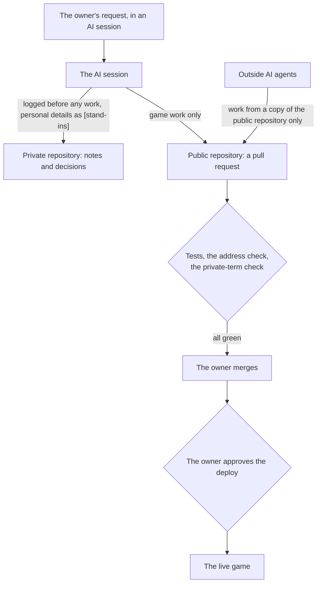

# Privacy by design — how personal information stays out of this project

This page explains how the project keeps personal information out of public code, and what protects
the game's players. It is written for anyone evaluating the project: another AI, a collaborator or an
investor. It names no person and no account. Status is marked on every item: **in place**, or **being
added**.

## Two repositories, one rule

The project is split in two. **This repository is public**: the game, its engine, its tests, its art
and the AI crew's working methods. **A private repository** keeps the owner's own notes and decisions,
the original history, private tools, and anything that describes a real person.

**The rule: nothing about a real person reaches the public repository as said.** Where a design
decision needs its reason, the reason is kept and the person is replaced by a bracketed stand-in such
as `[partner]` or `[city]`.

## How the public repository was made

The public repository was generated once from the private originals, not written by hand:

1. **An allowed list.** A file is published only if the list names it. Anything new is private by default.
2. **A private map.** It is kept outside both repositories and lists each personal detail with its
   stand-in, or with a one-line note saying why a passage mattered.
3. **A mechanical read-back.** The whole result is read again, code included. Any mapped detail left
   anywhere fails the run, and the tool reports only a rule number and a line, never the detail.
4. **A proof that code did not change.** Only comments may change. A JavaScript parser compares every
   file token by token with its original.
5. **A human read.** Reviewers look for what no list can name: a detail said in other words, or a
   harmless fact that becomes identifying next to another.

The public history starts at that moment. The earlier history is kept in the private archive.

## What protects the public repository

| Protection | What it stops | Status |
|---|---|---|
| The main branch is locked: no direct push, no deletion; every change is a pull request that must pass the tests | anyone, AI or person, rewriting the game directly | in place |
| The owner approves every deploy to the live site | a bad change reaching players | in place |
| Commits and files may carry only no-reply e-mail addresses | personal addresses in the history | in place |
| Every change is read against the private map's terms, which are held as an encrypted repository secret and never printed | a personal detail in new work | being added |
| Secret scanning with push protection | a password or token committed by mistake | in place |
| Third-party code and fonts are pinned by fingerprint | a swapped library running as the game | in place |
| Outside AI agents work from a copy of the public repository and sign their own commits | an outside agent reaching private material, or its work passing as the owner's | in place for this repository; the private one is never shared |

## What protects the players

The game is built like a console game: it lives on the player's device.

- **No account, no server, no analytics.** Saves stay in the browser's own storage.
- **The page asks no other website for anything.** Scripts, styles, fonts and pictures come from the
  game's own site, and background connections are switched off by the page's security policy.
- **No script written inside the page can run**, so text can never become code.
- **No referrer** goes to a site the player follows a link to, and **the page hides itself inside
  another site's frame**.
- **It plays offline** and updates itself with one refresh.
- A save moves between devices **only when the player moves it**, and a save someone else sends is
  checked piece by piece and asks before it replaces anything.

Every item above is enforced by a test on every change, not only described. `SECURITY.md` has the
details and how to report a problem.
